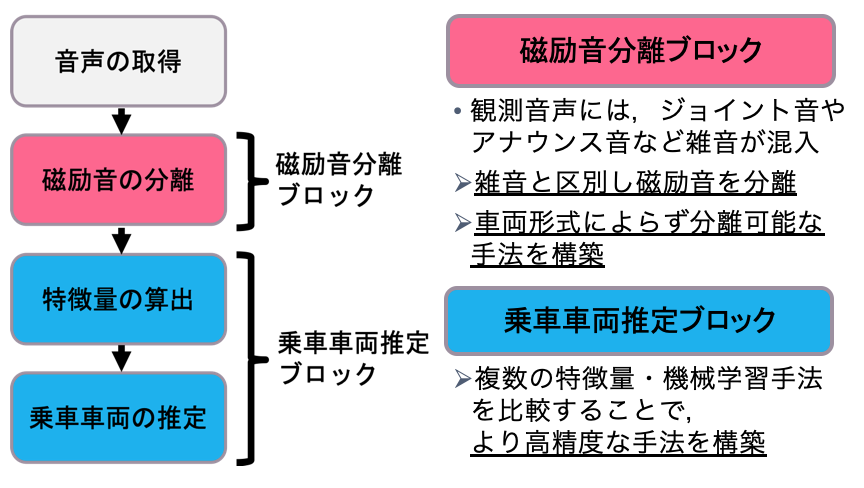
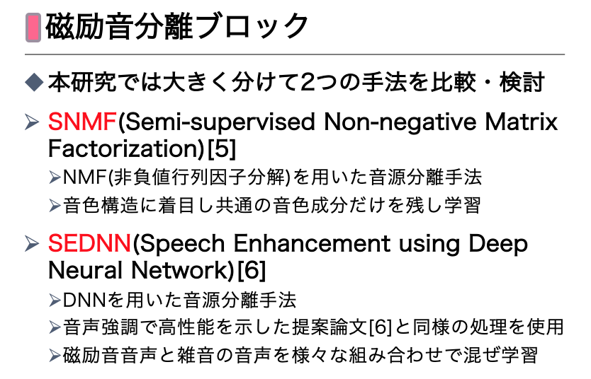
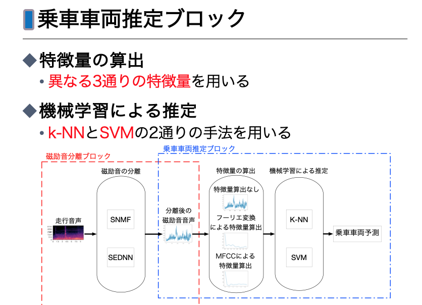

# 磁励音を用いた乗車車両位置推定





## 手順要約
1. SNMFとSEDNNでそれぞれ磁励音を学習
1. 学習済モデルを用いてpredict_positionで車両の推定

## 各フォルダの説明
- SNMF
-- SNMFに必要なコード・データと，最終的な評価を行うためのコードが混在しています（ごめんなさい）．詳細はフォルダ内をみてください．
- SEDNN
-- SEDNNを行うためのコードとデータが入っています．（Google colabで使用していました．）
- UNet
-- SEDNNを検討する前に使っていたUnetを用いた音源分離のコードが入っています．実装途中で辞めたので書き途中ですが一応動きます．(遊べます)
- predict_position
-- 磁励音を分離して乗車車両を推定するコードが入ってます．（Google colabで使用していました．）

## 環境構築について
Dockerを使っていなかったのでDockerファイルないです...

## 個人的な感想
- SNMFが有効に働いた理由は，SNMF自身が良いのではなくて，音声を復元せずに行列Gをそのまま特徴量として用いる点にありそう
-- 行列Gは，分離の音声に対してあるデータ点数ごとに集約している(ある種のLPFを通っている)ようなものなので，
SEDNNでもその部分を実装するとさらに精度があがりそう
(現時点ではSEDNNは音声に復元していますが，DNNが出力するのはスペクトル値なので計算コスト的にも有利に働く)
- SEDNNの学習時の工夫点が何もない点
-- 一つのモデルで異なるSNRに対しても対処させたり，雑音重畳音声のバリエーションを増やしたり，水増しをしてみたり，色々方法がありあそう
- SNMFについては，他にも色々拡張ができそう
-- そもそもSNMF自体にあまり論文がないような気がするので，
例えば基底の設計にNMFで用いられていた手法(ガウシアンプロセスに基づくものや，調波構造・非調波構造でパターンを作る方法)を適用して性能がどうなるか比較しても良さそう．
また，β-divergenceじゃなくてt分布に従うt-NMFを適用してみる・t-SNMFを作ってみるとかもできそう．
2018年にオートエンコーダーを利用したNMFがかなり高精度に分離できるみたいな論文もあったので，そういうのをSNMFに使うとかもできそう．
- (SNMFのβ=0がかなり怪しい)
-- 他論文では性能が一番高くなることが多く，今回のSDR,SARのように著しく性能が低下することはない．
色々検証してみましたが，最適化自体は働いている様子なので，更新式の問題ではない気もします．
Qitaなどに挙げてみて反応があればまた追記しようと思います．

## 追記
ファイルが無くて動作しなかったり，コードの意味がわからない場合は気軽に聞いて頂けると幸いです．
(特にコメントが少ない箇所があったり，書いたコードに対して深くテストもしていないのでミスなど多数あると思います)
もし卒業後で返信が返ってこない場合などはyuyuponzu@gmail.comに連絡を頂けるとすぐ返信ができると思います．