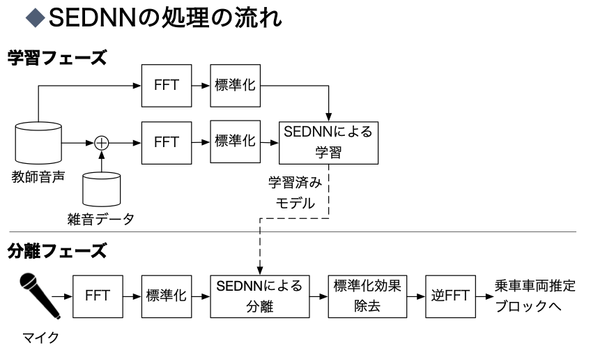

# SNMFによる磁励音分離

具体的な処理はITS研究会の論文や修論，ミーティング資料に書いているのでそちらを参照してください．
[ここ](https://)にあるデータをこのフォルダに入れてください
(要らないファイルも多数存在しますが，検証する上で必要となったりしていたので一応残してあります)

## 各スクリプトの要約
- config.py
- data_fenerator.py
- spectrogram_to_wavs.py
- main_dnn.py
- evaluate.py
-- 全て[SEDNN](https://github.com/yongxuUSTC/sednn)に基づいたものです．
いくつか実行できないバグがあったのでその修正と，mir_evalを用いて分離性能を評価できるように改変している部分があります．
- DNN_separate.ipynb
-- 実際にGoogle colab上で動かすためのスクリプトです．
このスクリプトでは，0~25dBに対応するモデルを「それぞれ」学習することで磁励音の分離を行なっています．
(issuesに記載の問題に合わせ別々のSNRでモデルを分けていますが，本来は一つのモデルで性能を図るべきです...)

## big_dataファイルの要約
- train_speech
-- 学習に用いる磁励音のみの音声です
- train_noise
-- 学習に用いる雑音のみの音声です
- test_speech
-- テストに用いる磁励音のみの音声です
- test_noise
-- 列車走行音のみの音声です