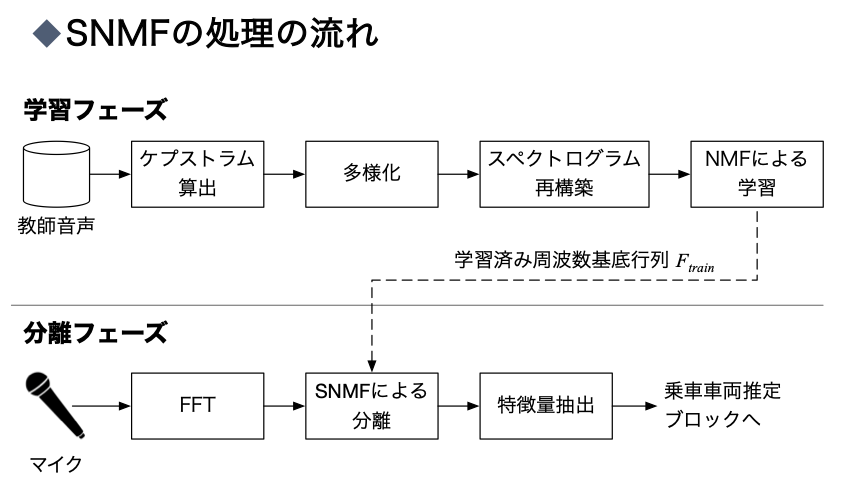

# SNMFによる磁励音分離

具体的な処理はITS研究会の論文や修論，ミーティング資料に書いているのでそちらを参照してください．
[ここ](https://)に，研究に使用したデータをまとめています．
(all_datasは，使ってなさそうなデータも含め，自分のワークスペースに残っていたもの全てをコピーしたものです．
simple_datasは必要そうなものだけを残したものです．その為npy化したデータを読み出す処理などは"all_datas"から取ってくるかもう一度生成しなければなりません)

## 各スクリプトの要約
- nmf.py
-- NMFとSNMFの処理をまとめたもの
- sep.py
-- 乗車車両推定に必要な処理をまとめたもの
(無意味なクラス化をしているので，使いにくかったら変えてください．当初は基底数ごとにインスタンスを作る予定でした)
- tsne.py
-- t-SNEについてまとめたもの．bhtsneというライブラリをそれっぽく使えるようにしてます．
- separate_Evaluation.ipynb
-- SNMFだけでなく，SEDNNも含めて最終的な分離性能の評価をしているスクリプトです．
音声データの前処理〜SNMFによる学習〜SNMFによる分離とSEDNNによる分離〜分離性能の評価と可視化をやっています．
また，論文用のfigureを作ったり，車両推定の精度の可視化まで含めてしまっています．
ですので，これが一番重要なファイルになります．

## all_datas内の主要なデータファイルの要約
- 2019_Train_data_1st
-- 周船寺駅にて最初に実験を行いデータを取得したもので，佐藤先輩がジョイント音による車両推定をやっていた頃に取得したデータを加えたものです．
同一方向へ走行する303系のみを入れています．
(305というフォルダは走行音声の切り出し（目の前を通過してから止まるまで）をおこなったもの，305_defは切り出しを行なっていないものになります)
- 2019_Train_data_1st+2nd
-- 上記に加え，2回目に周船寺駅で取得した音声を追加したものになります．
同様に同一方向へ走行する303系のみの電車を入れています．
- 2019_Train_data_1st+2nd_undersampling
-- 1st+2ndのデータに対し，アンダーサンプリングでそれぞれのクラスについて数を揃えたものです．
- Experiments_data
実験で取得したデータの元ファイルです．
- mir_eval_data
-- 分離性能の評価で使うyoutubeから取得した音声ファイルをまとめたものです．normは-1dBまで正規化していることを示した名前です．
どのファイルを使っているからはseparate_Evaluation.ipynbに記載しています．
- npys
-- NMFは初期値鋭敏性が高い為，最適な初期値をまとめたもの．
共通成分だけを残し再構成したスペクトログラムに対して，
各時間フレームごとに切り出したものを基底数分クラスタに分け，そのスペクトルを初期値として与えます．
これによって調波構造を持つように基底を設計できる可能性が高まります．
(ITS研究会の発表資料の42ページに簡単に記述したもので，7月くらいまでのミーティング資料では調波構造が必要な理由を記載してあります)
- npys_tsne
-- tsneが処理にそこそこ時間かかるので，必要なファイルを書き出したもの
- paper_img
-- 論文用の図のまとめ
- SEDNN_Data_◯db
-- SEDNNによる分離後の音声をまとめたもの．
separate_Evaluation.ipynbでSEDNNもまとめて評価している都合でここに置いている．
- その他のnpyファイル
-- 検証で必要となったnumpyファイルです．
separate_Evaluation.ipynbの中で主に学習処理で使っています．

## all_datas内のあまり必要なさそうなファイルの要約
- data
-- 元々実験を行う前に，予備実験としてyoutube上の音声を用いていた時のデータです．
(特にもう必要ないと思いますが，どこかの検証でつかっている可能性があるので残してあります．)
- Nonspeech
-- SEDNN用の雑音のみの音声をまとめたものです．
論文用figureを生成するプログラムもseparate_Evaluation.ipynbに入っているので，その関係でこちらにも残してあります．
(SEDNN自体はgoogle colabで動かしていたので，音声ファイルをローカルに置く必要がありました．)
- writing_file
-- 書きかけだったり，以前の検証で使っていたスクリプトファイルを集めたもの